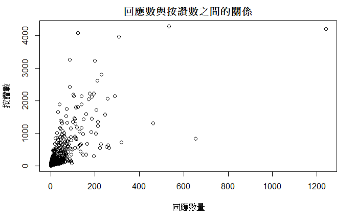

README第二組
---------
```{r}
library(tidyverse)
library(tidytext)
library(dplyr)
```


<h3>期中加分作業</h3>

對於這次的作業，我們想做的是一個對經濟學人(TheEconomist)粉絲專頁的分析結果。
https://www.facebook.com/TheEconomist
截至2017/11/15 上午1:50分，經濟學人粉絲專頁一共有8,368,367 人按讚，8,178,742 人追蹤。
雖然不像隔壁的CNN有著兩千九百萬人按讚，但是經濟學人的內容主要關注在社會科學，也就是經濟、政治以及社會方面，可能相對比較容易做出有建設性的分析結果。

```{r, warning=FALSE}
#install.packages("Rfacebook")
library(Rfacebook)

#options("browser"= NULL)  # for some Windows users if error occurs
fb_oauth <- fbOAuth(
  app_id = "952921794845515",     #                     # 填入應用程式編號
  app_secret = "xxxxxxxxxxxxxxxxxxxxx",   
  extended_permissions = TRUE)     # 填入應用程式密鑰     

save(fb_oauth, file="fb_oauth")
load("fb_oauth")

```

<h3>透過Rfacebook得到資料</h3>

首先，我們使用'getPage'的功能從粉專當中找出最近的500筆資料(之所以是500這個數字，是因為獲得更高的資料數需要更多的時間，而我們快趕不上這次作業的死線了)，然後將得到的Facebook時間訊息處理成R語言能夠使用的模式。

```{r}
#從經濟學人TheEconomist找資料

page <- getPage("TheEconomist", token=fb_oauth, n = 500, reactions = TRUE)
page[which.max(page$likes_count), ]

## 將Facebook的時間轉成R可以使用的模式

format.facebook.date <- function(datestring) {
    date <- as.POSIXct(datestring, format = "%Y-%m-%dT%H:%M:%S+0000", tz = "GMT")
}

page$datetime <- format.facebook.date(page$created_time)
```

簡單的做個圖，看看有甚麼發現

```{r}
plot(page$comments_count, page$likes_count, xlab = "回應數量", ylab = "按讚數", main = "回應數與按讚數之間的關係")

plot(page$datetime, page$likes_count, xlab = "時間軸", ylab = "按讚數", main = "日期與按讚數的關係")
```
<center></center>
<center></center>

稍微作圖會發現，回應數量跟按讚數似乎有一定的關係。
然後由於這裡目前只有500筆資料，因此時間軸有點短。如果能使用更多資料，找出日期時間與按讚人數的變化(例如:六日晚上可能較多人按讚?)，應該可以成為之後更有趣的研究。


<h3>針對新增的表情符號功能，與按讚數量的分析</h3>

另外，從上面的資料讓我們聯想到，Facebook最近新增的表情符號跟人們的反應行為有沒有關係呢?

```{r}
new.page <- drop_na(page)
print(sprintf("按讚次數跟回應次數的相關係數: %.4f", cor(new.page$likes_count, new.page$comments_count)))
print(sprintf("按讚次數跟分享次數的相關係數: %.4f", cor(new.page$likes_count, new.page$shares_count)))


print(sprintf("按讚次數跟愛心的相關係數: %.4f", cor(new.page$likes_count, new.page$love_count)))
print(sprintf("按讚次數跟大笑的相關係數: %.4f", cor(new.page$likes_count, new.page$haha_count)))
print(sprintf("按讚次數跟驚訝的相關係數: %.4f", cor(new.page$likes_count, new.page$wow_count)))
print(sprintf("按讚次數跟難過的相關係數: %.4f", cor(new.page$likes_count, new.page$sad_count)))
print(sprintf("按讚次數跟生氣的相關係數: %.4f", cor(new.page$likes_count, new.page$angry_count)))


print(sprintf("留言次數跟愛心的相關係數: %.4f", cor(new.page$comments_count, new.page$love_count)))
print(sprintf("留言次數跟大笑的相關係數: %.4f", cor(new.page$comments_count, new.page$haha_count)))
print(sprintf("留言次數跟驚訝的相關係數: %.4f", cor(new.page$comments_count, new.page$wow_count)))
print(sprintf("留言次數跟難過的相關係數: %.4f", cor(new.page$comments_count, new.page$sad_count)))
print(sprintf("留言次數跟生氣的相關係數: %.4f", cor(new.page$comments_count, new.page$angry_count)))
```
<center></center>

<h3>計算不同發佈方式的平均按讚數(如:連結網址、影片、照片)，以及其標準差</h3>

```{r}
page1 <- page %>%
  group_by(type) %>%
  summarise(avg = mean(likes_count), std = sd(likes_count)) %>%
  arrange(avg)
page2 <-count(group_by(page, type), type)
left_join(page1, page2)

```
<center></center>


從以上的(有效)統計當中，我們可以看到影片的點讚數明顯的比單純的網址連結高出約3倍!!!
可能也就是因為影片能夠觸及的人群較多，這或許也可以解釋為什麼近年來Facebook努力推動影片分享的功能。


<h3>使用tidytext分析標題內容，找出哪個標題關鍵字出現最多次</h3>

```{r}


page.message <- select(page, message)
page.message.words <- unnest_tokens(page.message, word, message)

data("stop_words")
cleaned.message.words <- page.message.words %>%
  anti_join(stop_words)

freq.word <- count(cleaned.message.words, word, sort = TRUE)
freq.word.final <- filter(freq.word, n > 10)

freq.word.final
```
<center></center>


可以看出第一名的people以39次奪冠，去除掉2,3,4名跟雜誌本身名字有關的資訊(1843為The Economist旗下的雜誌名)，主要得名的還有world, time, 美國總統Donald Trump等關鍵字。
另外也可以看出經濟學人雜誌常關注的議題，關於歷史、美國、政府等關鍵字也出現於其中。

